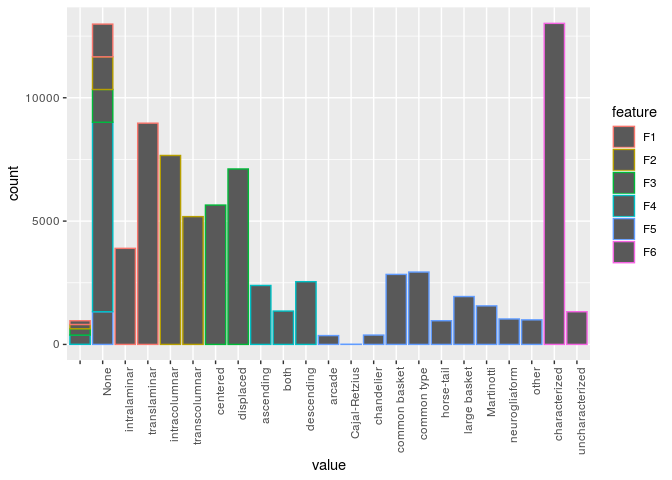
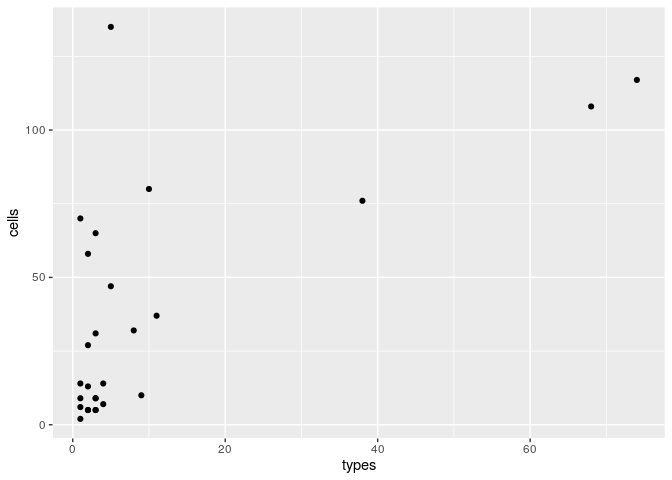
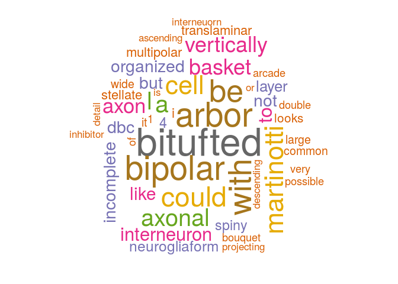

<!-- README.md is generated from README.Rmd. Please edit that file -->
gardenr
-------

The goal of gardenr is provide simple functions of analyzing the data
from Gardener’s interneuron classification as well as to provide
examples of analyses of such data.

Installation
------------

You can use the `devtools` package to install `garnenr` from Github.

``` r
devtools::install_github('ComputationalIntelligenceGroup/gardenr')
```

The user needs to provide the path to the folder containing the data.
These can be downloaded from …(TODO)

``` r
folder <- '/home/bmihaljevic/code-gardener/gardener-experiment-data/data/' 
library(tidyverse)
#> ── Attaching packages ───────────────────────────────────────────────────────────────────────────────────────────────────────── tidyverse 1.2.1 ──
#> ✔ ggplot2 3.2.0     ✔ purrr   0.3.2
#> ✔ tibble  2.1.3     ✔ dplyr   0.8.1
#> ✔ tidyr   0.8.3     ✔ stringr 1.4.0
#> ✔ readr   1.3.1     ✔ forcats 0.4.0
#> ── Conflicts ──────────────────────────────────────────────────────────────────────────────────────────────────────────── tidyverse_conflicts() ──
#> ✖ dplyr::filter() masks stats::filter()
#> ✖ dplyr::lag()    masks stats::lag()
```

Usage
-----

`garnenr` functions return the data for all 320 cells. There are
functions for the classification labels `get_all_labels`, metadata
`get_all_meta`, and alternative type names and definitions
`get_alternative_types`.

``` r
library(gardenr)
#> Warning: replacing previous import 'magrittr::extract' by 'tidyr::extract'
#> when loading 'gardenr'
#> 
#> Attaching package: 'gardenr'
#> The following object is masked from 'package:readr':
#> 
#>     read_csv
annotations <- get_all_labels(folder ) 
summary(annotations)
#>    annotator         neuron                 F1                   F2      
#>  1      :  320   1      :   48               : 151                : 175  
#>  2      :  320   2      :   48   intralaminar:3895   intracolumnar:7660  
#>  3      :  320   4      :   48   None        :1326   None         :1326  
#>  4      :  320   5      :   48   translaminar:8970   transcolumnar:5181  
#>  5      :  320   6      :   48                                           
#>  6      :  320   7      :   48                                           
#>  (Other):12422   (Other):14054                                           
#>          F3                F4                   F5      
#>           : 254             : 375   common type  :2934  
#>  centered :5649   ascending :2390   common basket:2839  
#>  displaced:7113   both      :1352   large basket :1941  
#>  None     :1326   descending:2543   Martinotti   :1563  
#>                   None      :7682   None         :1326  
#>                                     neurogliaform:1032  
#>                                     (Other)      :2707  
#>                F6                    other        complete      
#>  characterized  :13016   None           :13346   Mode :logical  
#>  uncharacterized: 1326   columnar basket:   70   FALSE:482      
#>                          unknown        :   68   TRUE :13860    
#>                          bushy cell     :   59                  
#>                          bitufted       :   40                  
#>                          double bouquet :   40                  
#>                          (Other)        :  719
```

``` r
alternative <- get_alternative_types(folder)
summary(alternative)
#>    annotator               type                            definition 
#>  23     :74   bipolar        :  5                               :163  
#>  27     :68   bitufted       :  5   see above.                  : 12  
#>  14     :38   double bouquet :  4   as it says.                 :  6  
#>  7      :11   bipolar?       :  3   see above                   :  4  
#>  30     :10   inverted arcade:  3   as above.                   :  2  
#>  18     : 9   bitufted?      :  2   deleted from the final list.:  2  
#>  (Other):59   (Other)        :247   (Other)                     : 80
```

``` r
metadata <- get_all_meta(folder)
summary(metadata)
#>      neuron         neuromorpho.name   species                   area    
#>  1      :  1   None         : 79     Cat   : 10   Area not reported:  1  
#>  2      :  1   020227-slice1:  1     Human : 11   Auditory         :  1  
#>  3      :  1   020315-2-ST  :  1     Monkey: 68   Frontal          :  8  
#>  4      :  1   020315-3-ST  :  1     Mouse : 78   Prefrontal       : 33  
#>  5      :  1   020515-2-NPY :  1     Rabbit:  2   Somatosensory    :184  
#>  6      :  1   020530-2-NPY :  1     Rat   :151   Temporal         :  9  
#>  (Other):314   (Other)      :236                  Visual           : 84  
#>           layer      rotated                   archive   
#>  II          :  4   Mode :logical   Gonzalez-Burgos: 15  
#>  III         : 16   FALSE:310       Helmstaedter   : 43  
#>  II/III      :136   TRUE :10        Markram        :104  
#>  IV          : 98                   Yuste          : 78  
#>  not reported: 30                   NA's           : 80  
#>  V           : 33                                        
#>  VI          :  3                                        
#>                             original.type
#>  Not reported                      :79   
#>  Basket cell                       :57   
#>  Martinotti cell                   :33   
#>  Somatostatin (SOM) containing cell:18   
#>  Bitufted cell                     :12   
#>  (Other)                           :41   
#>  NA's                              :80   
#>                                                                                                                                  paper    
#>  Anatomical, physiological, molecular and circuit properties of nest basket cells in the developing somatosensory cortex            :104  
#>  The relation between dendritic geometry, electrical excitability, and axonal projections of L2/3 Interneurons in rat barrel cortex.: 43  
#>  Internal dynamics determine the cortical response to thalamic stimulation                                                          : 17  
#>  Correlation between axonal morphologies and synaptic input kinetics of interneurons from mouse visual cortex                       : 16  
#>  Calcium microdomains in aspiny dendrites                                                                                           : 15  
#>  (Other)                                                                                                                            :104  
#>  NA's                                                                                                                               : 21
```

To get data on a specific cell or annotator, we only need filter by id:

``` r
metadata %>% filter(neuron == 12)
#>   neuron    neuromorpho.name species       area  layer rotated
#> 1     12 03-27-01-3wideArbor  Monkey Prefrontal II/III   FALSE
#>           archive original.type
#> 1 Gonzalez-Burgos   Basket cell
#>                                                                                                                                                           paper
#> 1 Cluster analysis-based physiological classification and morphological properties of inhibitory neurons in layers 2-3 of monkey dorsolateral prefrontal cortex
head(annotations %>% filter(neuron == 12))
#>   annotator neuron           F1            F2        F3         F4
#> 1         1     12 translaminar transcolumnar  centered       None
#> 2         2     12 translaminar transcolumnar  centered       None
#> 3         3     12 translaminar transcolumnar displaced descending
#> 4         4     12 translaminar transcolumnar displaced       both
#> 5         5     12 translaminar transcolumnar  centered       None
#> 6         6     12 translaminar transcolumnar  centered       None
#>             F5            F6 other complete
#> 1 large basket characterized  None     TRUE
#> 2 large basket characterized  None     TRUE
#> 3 large basket characterized  None     TRUE
#> 4 large basket characterized  None     TRUE
#> 5 large basket characterized  None     TRUE
#> 6 large basket characterized  None     TRUE
```

``` r
head(annotations %>% filter(annotator == 2))
#>   annotator neuron           F1            F2        F3        F4
#> 1         2      1 intralaminar intracolumnar  centered      None
#> 2         2      2 translaminar transcolumnar displaced      both
#> 3         2      3 translaminar intracolumnar displaced ascending
#> 4         2      4 intralaminar intracolumnar  centered      None
#> 5         2      5 translaminar transcolumnar  centered      None
#> 6         2      6 intralaminar intracolumnar  centered      None
#>              F5            F6 other complete
#> 1 neurogliaform characterized  None     TRUE
#> 2    chandelier characterized  None     TRUE
#> 3    Martinotti characterized  None     TRUE
#> 4   common type characterized  None     TRUE
#> 5 common basket characterized  None     TRUE
#> 6 neurogliaform characterized  None     TRUE
alternative %>% filter(annotator == 2)
#> [1] annotator  type       definition
#> <0 rows> (or 0-length row.names)
```

It is easy to combine the three data frames using joins, and then
compute summaries with `tidyverse` functions. For example, the
alternative type definition to an annotation

``` r
head(left_join(annotations, alternative, by = c("other" = "type", "annotator" = "annotator"))) 
#> Warning: Column `other`/`type` joining factors with different levels,
#> coercing to character vector
#> Warning: Column `annotator` joining factors with different levels, coercing
#> to character vector
#>   annotator neuron           F1            F2        F3         F4
#> 1         1      1 intralaminar intracolumnar  centered       None
#> 2         1      2 translaminar transcolumnar displaced descending
#> 3         1      3 translaminar transcolumnar displaced  ascending
#> 4         1      4 translaminar intracolumnar  centered       None
#> 5         1      5 translaminar transcolumnar  centered       None
#> 6         1      6 intralaminar intracolumnar  centered       None
#>              F5            F6 other complete definition
#> 1 neurogliaform characterized  None     TRUE       <NA>
#> 2    chandelier characterized  None     TRUE       <NA>
#> 3    Martinotti characterized  None     TRUE       <NA>
#> 4 common basket characterized  None     TRUE       <NA>
#> 5  large basket characterized  None     TRUE       <NA>
#> 6 neurogliaform characterized  None     TRUE       <NA>
```

The primary key in `alternative` consits of `annotator` and `type` and
hence we need both in the join.

There is a utility function to return the counts for all categories,
with a single entry per neuron.

``` r
counts <- get_all_counts(folder) 
#> Warning: attributes are not identical across measure variables;
#> they will be dropped
head(counts)
#> # A tibble: 6 x 22
#>   neuron intralaminar translaminar intracolumnar transcolumnar centered
#>   <fct>         <int>        <int>         <int>         <int>    <int>
#> 1 1                44            2            44             0       44
#> 2 2                21           26            29            17        4
#> 3 3                 1           45            36             8        1
#> 4 4                 9           28            34             2       33
#> 5 5                 4           43             8            39       30
#> 6 6                45            1            45             0       44
#> # … with 16 more variables: displaced <int>, ascending <int>, both <int>,
#> #   descending <int>, arcade <int>, `Cajal-Retzius` <int>,
#> #   chandelier <int>, `common basket` <int>, `common type` <int>,
#> #   `horse-tail` <int>, `large basket` <int>, Martinotti <int>,
#> #   neurogliaform <int>, other <int>, characterized <int>,
#> #   uncharacterized <int>
```

We can join the above with metadata to get thorough information for each
cell.

``` r
meta_count <- left_join(counts, metadata, by = 'neuron') %>% select(-paper, -original.type, -archive, -neuromorpho.name)
head(meta_count)
#> # A tibble: 6 x 26
#>   neuron intralaminar translaminar intracolumnar transcolumnar centered
#>   <fct>         <int>        <int>         <int>         <int>    <int>
#> 1 1                44            2            44             0       44
#> 2 2                21           26            29            17        4
#> 3 3                 1           45            36             8        1
#> 4 4                 9           28            34             2       33
#> 5 5                 4           43             8            39       30
#> 6 6                45            1            45             0       44
#> # … with 20 more variables: displaced <int>, ascending <int>, both <int>,
#> #   descending <int>, arcade <int>, `Cajal-Retzius` <int>,
#> #   chandelier <int>, `common basket` <int>, `common type` <int>,
#> #   `horse-tail` <int>, `large basket` <int>, Martinotti <int>,
#> #   neurogliaform <int>, other <int>, characterized <int>,
#> #   uncharacterized <int>, species <fct>, area <fct>, layer <fct>,
#> #   rotated <lgl>
```

There is a utility function doing just that:

``` r
head(get_all_counts_meta(folder) )
#> Warning: attributes are not identical across measure variables;
#> they will be dropped
#> # A tibble: 6 x 26
#>   neuron intralaminar translaminar intracolumnar transcolumnar centered
#>   <fct>         <int>        <int>         <int>         <int>    <int>
#> 1 1                44            2            44             0       44
#> 2 2                21           26            29            17        4
#> 3 3                 1           45            36             8        1
#> 4 4                 9           28            34             2       33
#> 5 5                 4           43             8            39       30
#> 6 6                45            1            45             0       44
#> # … with 20 more variables: displaced <int>, ascending <int>, both <int>,
#> #   descending <int>, arcade <int>, `Cajal-Retzius` <int>,
#> #   chandelier <int>, `common basket` <int>, `common type` <int>,
#> #   `horse-tail` <int>, `large basket` <int>, Martinotti <int>,
#> #   neurogliaform <int>, other <int>, characterized <int>,
#> #   uncharacterized <int>, species <fct>, area <fct>, layer <fct>,
#> #   rotated <lgl>
```

These data are also available in a different format, which is a bit
easier to analyze

``` r
annot_tidy <- make_annotations_tidy(annotations) 
#> Warning: attributes are not identical across measure variables;
#> they will be dropped
head(annot_tidy )
#>   annotator neuron feature        value
#> 1         1      1      F1 intralaminar
#> 2         1      2      F1 translaminar
#> 3         1      3      F1 translaminar
#> 4         1      4      F1 translaminar
#> 5         1      5      F1 translaminar
#> 6         1      6      F1 intralaminar
```

Examples
--------

-   How many partially labelled cells?

``` r
table(annotations$complete) 
#> 
#> FALSE  TRUE 
#>   482 13860
```

-   Get raw frequencies of the different categories

``` r
annot_tidy <- make_annotations_tidy(annotations) 
#> Warning: attributes are not identical across measure variables;
#> they will be dropped
annot_tidy %>% group_by(feature, value) %>% tally()
#> # A tibble: 31 x 3
#> # Groups:   feature [6]
#>    feature value             n
#>    <chr>   <fct>         <int>
#>  1 F1      ""              151
#>  2 F1      None           1326
#>  3 F1      intralaminar   3895
#>  4 F1      translaminar   8970
#>  5 F2      ""              175
#>  6 F2      None           1326
#>  7 F2      intracolumnar  7660
#>  8 F2      transcolumnar  5181
#>  9 F3      ""              254
#> 10 F3      None           1326
#> # … with 21 more rows
# library(ggplot2)
ggplot(annot_tidy, aes(x = value, color = feature)) + geom_bar() + theme(axis.text.x = element_text(angle = 90, hjust = 1))
```



-   Only consider cells with above &gt; 30 neurocientists agreeing on a
    specific label

``` r
annot_tidy <- make_annotations_tidy(annotations) 
#> Warning: attributes are not identical across measure variables;
#> they will be dropped
above30 <- annot_tidy %>% group_by(neuron, feature, value) %>% tally() %>% filter(n > 30)
above30 %>% group_by(feature) %>% summarize(n_distinct(neuron))  
#> # A tibble: 6 x 2
#>   feature `n_distinct(neuron)`
#>   <chr>                  <int>
#> 1 F1                       237
#> 2 F2                       240
#> 3 F3                       216
#> 4 F4                       219
#> 5 F5                        57
#> 6 F6                       305
```

-   Restrict analysis to unrotated, monkey cells

``` r
monkey <- metadata %>% filter(species == 'Monkey')
counts <- get_all_counts_meta(folder)
#> Warning: attributes are not identical across measure variables;
#> they will be dropped
counts %>% filter(species == 'Monkey') 
#> # A tibble: 68 x 26
#>    neuron intralaminar translaminar intracolumnar transcolumnar centered
#>    <fct>         <int>        <int>         <int>         <int>    <int>
#>  1 1                44            2            44             0       44
#>  2 6                45            1            45             0       44
#>  3 9                 4           43             8            38       30
#>  4 12                9           35             1            44       35
#>  5 14                1           43            45             0       27
#>  6 22                2           39            41             1        4
#>  7 27               18           27            44             1       39
#>  8 28                1           40            39             3        1
#>  9 33               34            9            41             1       31
#> 10 37               37            0            36             0       30
#> # … with 58 more rows, and 20 more variables: displaced <int>,
#> #   ascending <int>, both <int>, descending <int>, arcade <int>,
#> #   `Cajal-Retzius` <int>, chandelier <int>, `common basket` <int>,
#> #   `common type` <int>, `horse-tail` <int>, `large basket` <int>,
#> #   Martinotti <int>, neurogliaform <int>, other <int>,
#> #   characterized <int>, uncharacterized <int>, species <fct>, area <fct>,
#> #   layer <fct>, rotated <lgl>
```

### Alternative type names

-   27 out of 48 neuroscientists provided alternative type names for the
    cells

``` r
length(unique(alternative$annotator))
#> [1] 27
unique(alternative$annotator) 
#>  [1] 1  4  7  9  13 14 15 18 19 23 24 25 26 27 29 30 31 34 35 36 37 39 40
#> [24] 41 43 44 48
#> 27 Levels: 1 4 7 9 13 14 15 18 19 23 24 25 26 27 29 30 31 34 35 36 ... 48
```

-   How many alternative types per neuroscientist? How many other cells
    per neuroscientist?

``` r
types <- alternative %>% group_by(annotator) %>% tally()
other <- annotations %>% group_by(annotator) %>% filter(F5 == 'other') %>% tally()
ggplot(data.frame(types = types$n, cells = other$n), aes(x = types, y = cells)) + geom_point()
```



-   Words used in alternative types and definitions:
    -   The most common word is \`bitufted’

``` r
library(tidytext)
library(wordcloud)
#> Loading required package: RColorBrewer
alt <- alternative 
alt$type <- as.character(alternative$type ) 
alt <- alt %>% unnest_tokens(type, type)
alt %>%  count(type, sort = TRUE)      
#> # A tibble: 271 x 2
#>    type           n
#>    <chr>      <int>
#>  1 bitufted      44
#>  2 arbor         38
#>  3 bipolar       38
#>  4 with          36
#>  5 be            35
#>  6 could         30
#>  7 martinotti    29
#>  8 cell          28
#>  9 a             26
#> 10 axonal        25
#> # … with 261 more rows
alt %>%  count(type, sort = TRUE)      %>%  with(wordcloud(type, n, random.order = FALSE, max.words = 50 , colors= brewer.pal(8,"Dark2")))
```



``` r
alt <- alternative 
alt$definition <- as.character(alternative$definition )   
alt <- alt %>% unnest_tokens(definition, definition)
alt <- alt %>% anti_join(get_stopwords(), by = c("definition" = "word"))
alt %>%  count(definition, sort = TRUE)      
#> # A tibble: 427 x 2
#>    definition     n
#>    <chr>      <int>
#>  1 axonal        37
#>  2 cells         30
#>  3 cell          25
#>  4 see           22
#>  5 layer         20
#>  6 soma          18
#>  7 arbor         15
#>  8 domain        15
#>  9 layers        14
#> 10 dendritic     13
#> # … with 417 more rows
alt %>%  count(definition, sort = TRUE)      %>%  with(wordcloud(definition, n, random.order = FALSE, max.words = 50 , colors= brewer.pal(8,"Dark2")))
```


\`\`\`
